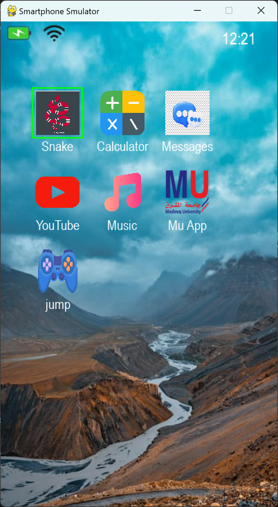
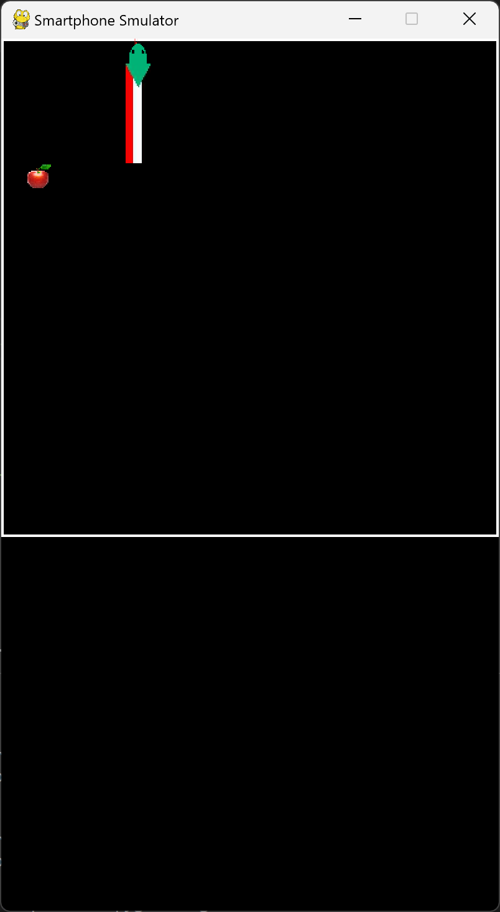

---

### 📄 محتوى ملف `README.md`:

````markdown
# 📱 Virtual Phone Simulator

محاكاة واجهة هاتف ذكي باستخدام **Python** و **Pygam*.  
يمكنك تشغيل التطبيقات، التنقل بينها، الاستماع للموسيقى، ولعب الألعاب مثل الثعبان 🐍 داخل بيئة تفاعلية واحدة.

---

## ✨ المميزات:
- 🔒 **شاشة قفل** بكلمة مرور.
- 🕒 **ساعة حية** في الواجهة.
- 📱 **تطبيقات مدمجة**:
  - 🎮 لعبة الثعبان Snake (بصور رأس وجسم متحركة).
  - 🧮 آلة حاسبة.
  - 🎵 قارئ موسيقى مع تشغيل 3 مسارات صوتية.
  - 💬 تطبيق رسائل متصل مع بوت تليجرام.
- 🎨 واجهة أنيقة تحاكي الهاتف الذكي.

---

## 🚀 كيفية التشغيل
1. تأكد من تثبيت **Python 3.11+** ✅
2. ثبّت مكتبات المشروع:
   ```bash
   pip install pygame pyTelegramBotAPI
````

3. شغّل البرنامج:

   ```bash
   python main.py
   ```

---

## 📂 متطلبات المشروع:

* Python 3.11+
* مكتبة **Pygame**
* مكتبة **Telebot** (لتطبيق الرسائل)

---

## 📸 صور من المشروع:

### 🏠 الشاشة الرئيسية



### 🐍 لعبة الثعبان



---

## 🧑‍💻 المطور

👨‍💻 **Omer ELSAWY**
📧 **[om3relsawy@gmail.com](mailto:om3relsawy@gmail.com)**
🔗 [حسابي على GitHub](https://github.com/OmerElSawy)

---

## 📝 الرخصة

تم تطوير هذا المشروع لأغراض تعليمية باستخدام Python.
OMER ELSAWY


 